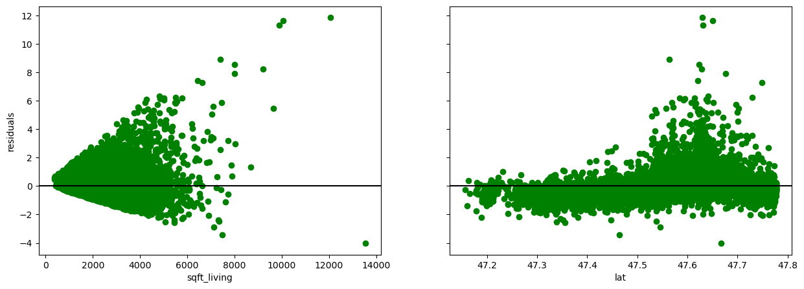

# HomeRenovation-RegressionAnalysis project

## Business Understanding
### *Introduction*
The real estate agency aims to leverage data analysis and multiple linear regression modeling to provide valuable insights and advice to homeowners regarding home renovations and their potential impact on the estimated value of their properties. By analyzing historical sales data and employing multiple linear regression modeling, the real estate agency can provide evidence-based recommendations to homeowners, helping them prioritize renovations and estimate the potential increase in their home's value.

### *Problem Statement*:
The problem at hand is to assess the impact of home renovations on the estimated value of properties in the northwestern country. The real estate agency needs to determine the specific renovations that are likely to yield the highest return on investment and provide homeowners with accurate advice on how these renovations can potentially increase the estimated value of their homes.

### *Main Objective* :
The main objective of this project is to develop a  non-robust multiple linear regression model using the King County house sales dataset to estimate the impact of home renovations on the sale price of properties accurately. The model will serve as a tool for the real estate agency to provide homeowners with advice on how renovations might increase the estimated value of their homes and by what amount.

### *Specific Objective* :

* Explore and preprocess the King County house sales dataset, ensuring that the necessary variables related to home renovations are included    and properly handled.
* Select relevant features from the dataset that are likely to have a significant impact on the sale price, including variables related to home renovations.
* Develop a non-robust multiple linear regression model using the selected features and the sale price as the target variable.
* estimate the regression coefficients for each feature, including those related to home renovations.
* Analyze the coefficients of the renovation-related features to determine the estimated impact of different renovations on the sale price.
* Provide homeowners with specific recommendations and insights on how home renovations can potentially increase the estimated value of their    properties, including the approximate amount by which the sale price might increase for each renovation.
* Evaluate the model's performance and fine-tune it if necessary, ensuring that it accurately captures the relationship between renovations and the sale price of properties.
* Monitor market trends and updates in renovation practices to continuously enhance the model's recommendations and provide homeowners with up-to-date insights.

### Data Understanding

The data sources for this analysis will be pulled from the following file :
* **Source**: This dataset comes from: <a href="https://info.kingcounty.gov/assessor/esales/Glossary.aspx?type=r">King County Assessor Website</a>
* **Contents**: It contains data of :
id: date: price: bedrooms: bathrooms: sqft_living:sqft_lot: floors: waterfront: view: condition: grade: sqft_above: sqft_basement: yr_built: yr_renovated: zipcode: lat: long: sqft_living15: sqft_lot15: 
* **Format**: CSV data 

* Rationale:
the goal was to identify the significant factors that influence home prices and provide insights for pricing and valuation purposes.
* Results
    The multilinear regression analysis resulted in a model that explains approximately 59.4% of the variance in home prices, as indicated by the adjusted R-squared value. This suggests that the included predictors collectively have a moderate ability to explain and predict the variation in home prices.

    The analysis identified several predictors with significant impacts on home prices. The number of bedrooms, bathrooms, square footage of living area, latitude, property condition, and year of renovation all showed statistically significant coefficients. These findings indicate that these factors play a role in determining home prices.

* Limitations
   First, the analysis assumes a linear relationship between the predictors and the target variable. However, it's possible that some predictors have nonlinear relationships with home prices, which may not be captured adequately by the model.

   The included predictors may not capture all the relevant factors influencing home prices. There could be other important variables, such as neighborhood amenities, school quality, or economic factors, that were not included in the analysis. The absence of these variables may limit the model's explanatory power and predictive accuracy.

   The analysis assumes that the underlying data meets the assumptions of multilinear regression, such as independence, linearity, and homoscedasticity. Violations of these assumptions can affect the validity of the results.

   The model's performance, as indicated by the adjusted R-squared value, suggests that there is still a significant portion of the variance in home prices that remains unexplained. This indicates that there are other factors beyond the included predictors that contribute to home prices.
   
   The results of the analysis are specific to the dataset and context used. The findings may not generalize well to other regions, time periods, or housing markets with different characteristics.

   ## recommendations

* Renovate and Improve Property Condition: The condition of the property (condition_Very Good) has a positive impact on the estimated home prices. Homeowners should focus on improving the overall condition of their properties by addressing any maintenance issues, upgrading fixtures, and enhancing the overall appearance and functionality of the home.
* Increase Living Space: The square footage of the living area positively impact the estimated home prices. Increasing the living space can attract potential buyers and potentially lead to higher property values.
Pay Attention to Bedroom and Bathroom Ratios: Although the number of bedrooms and bathrooms still have an average impact on the estimated home prices in the model, it is essential to consider other factors and interactions. Homeowners should ensure that the bedroom and bathroom ratios are appropriate for the size of the home and the target market. For example, a three-bedroom house might benefit from having at least two bathrooms to meet the expectations of potential buyers.
* Consult with Real Estate Professionals: Real estate professionals have a comprehensive understanding of the local market conditions and factors that influence home prices. These professionals can provide insights into the local market trends, buyer preferences, and potential return on investment for various renovation projects.

project presentation, pdf format attached.
https://docs.google.com/presentation/d/1YpGwAH3KkBtRhSD30j0jhaE1SOqoVTAs_alDXCblfS8/edit?usp=sharing
